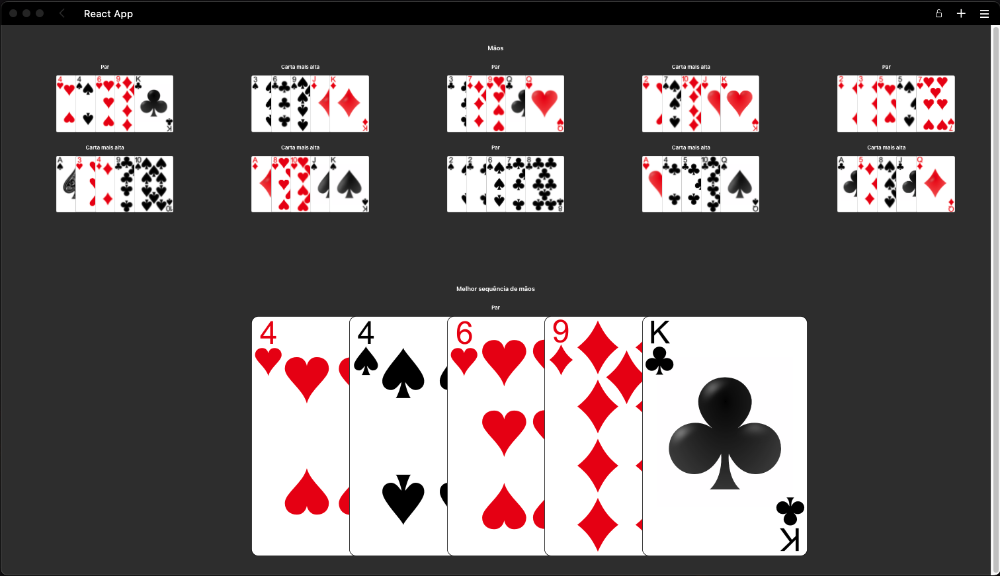
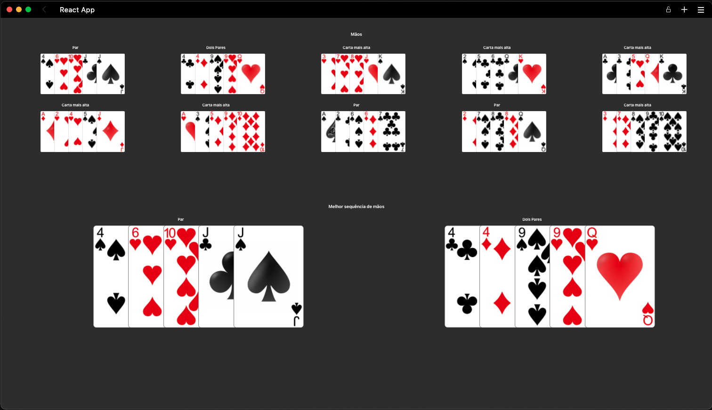
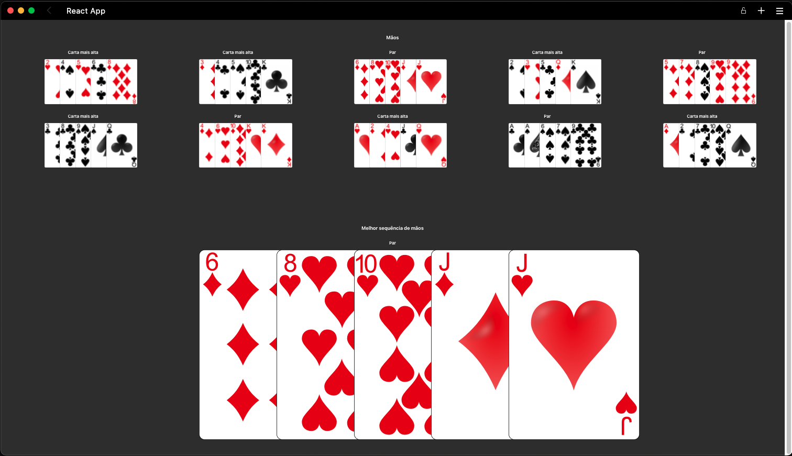

# Poker Hands

**Número da Lista**: 4 
**Conteúdo da Disciplina**: D&C 

## Alunos
|Matrícula | Aluno |
| -- | -- |
|16/0028361  |  Gabriel Batista Albino |

## Sobre 
O projeto tem como objetivo encontrar a maior soma em uma subarray. No caso da aplicação ao projeto, dado uma sequência de N mãos de poker, o algoritmo te indica a melhor sequência de mãos M, tal que M está contida em N e a mão é diferente de "Carta mais alta". Mais informações no vídeo de apresentação

## Screenshots

## Instalação 
**Linguagem**: JS 
**Framework**: React TS 

Pré-requisitos: Node v17.4.0

Vá até o diretorio do projeto e digite npm install
Após a conclusão da instalação, execute o comando npm run start
